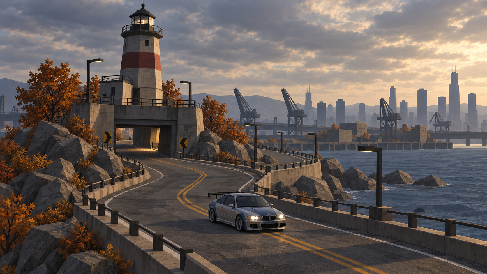
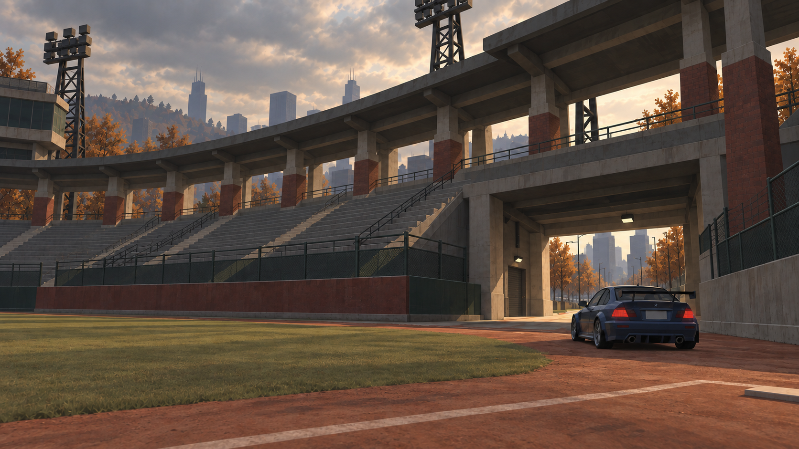
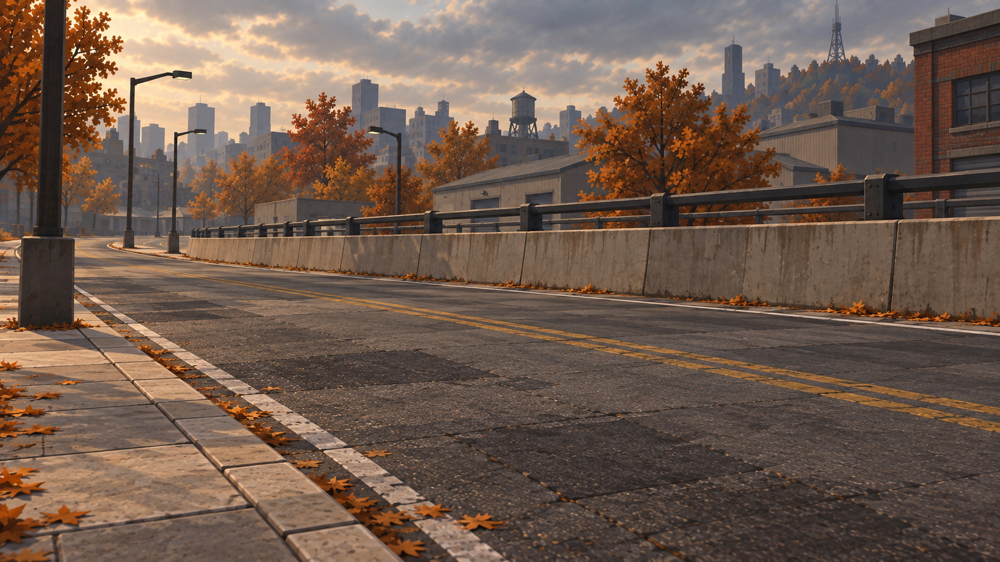
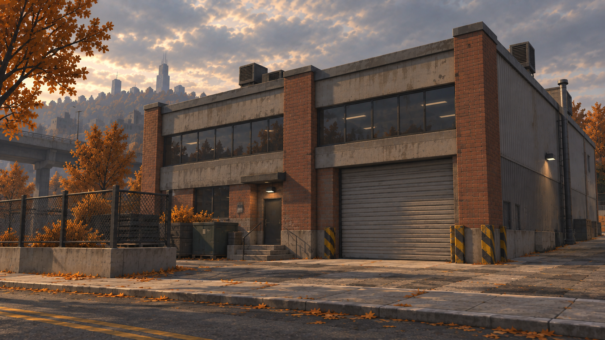
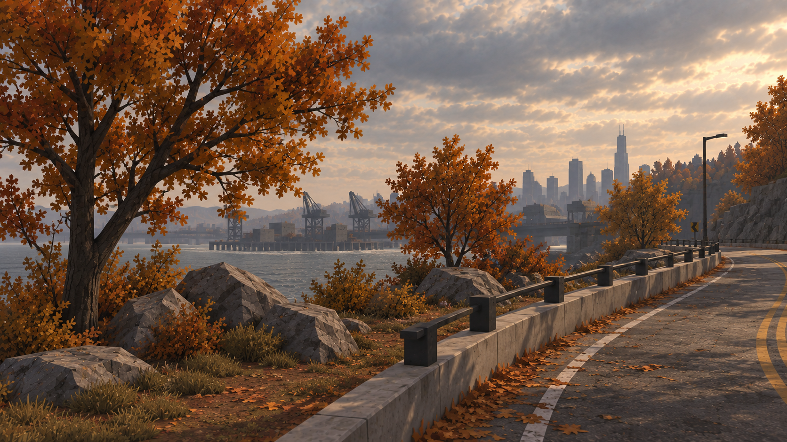
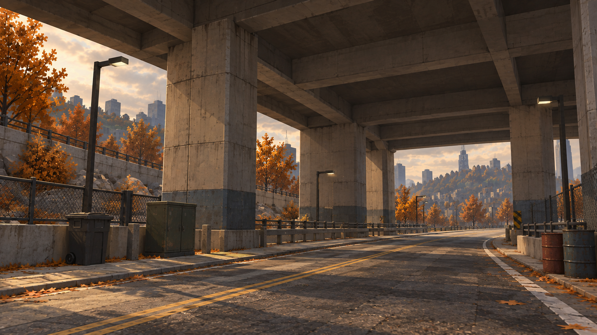
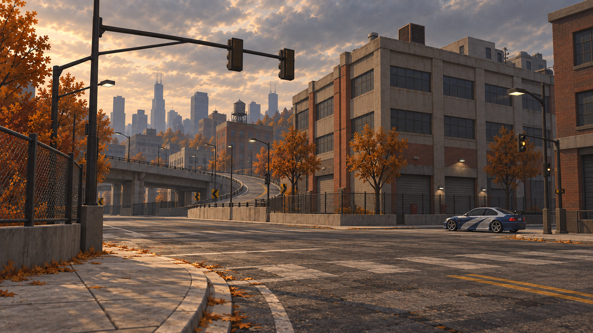
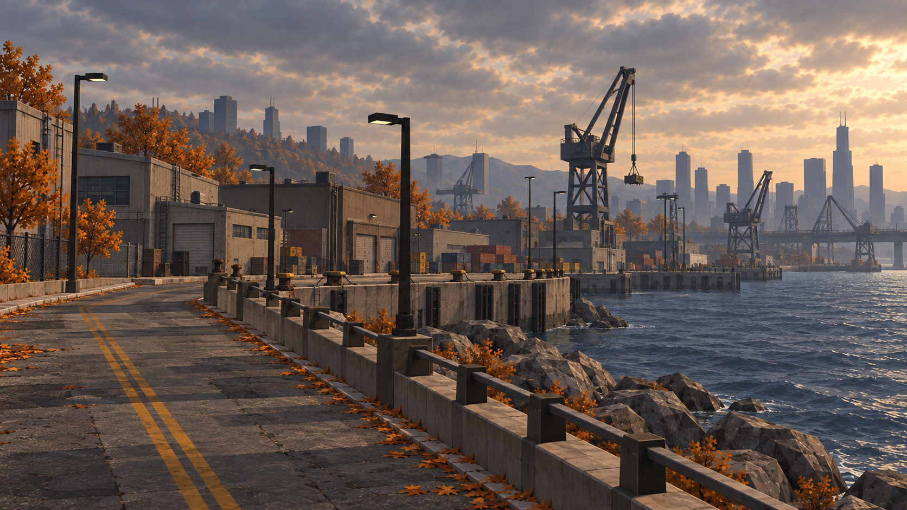

# Racing environment art references

This pack gives coding agents visual targets for adapting the already imported NFS World Downtown Rockport assets to a grounded, medium-detail low-poly style. Use realistic scale, substantial simple architecture, modest worn textures, irregular autumn foliage and restrained reflections.

Start with the [art style guide](ART-STYLE-GUIDE.md), then read the [existing-map adaptation guide](agent-reference-pack/ADAPTATION-GUIDE.md). The guides point to the current Blender/Unity pipeline and explain which geometry, UV regions, alpha masks and collision surfaces to preserve.

For a new map built from original Blender assets, use the [original modular map kit](../2026-10-04-original-map-kit/README.md). It keeps the same visual targets and adds asset sheets, proposed dimensions and connector rules for new geometry and textures.

## Primary style targets

The three balanced images define the working detail level. Supplementary images below provide closer material and environmental context.

| Lighthouse | Rosewood safehouse | Hickley Field |
| --- | --- | --- |
|  |  |  |

## Supplementary studies

| Road, curb and barrier | Facade, glass and metal |
| --- | --- |
|  |  |
| Foliage, rocks and ground | Underpass, props and shadow |
|  |  |
| Downtown intersection | Waterfront infrastructure |
|  |  |

## Complete contents

The pack includes 19 PNGs and all five original guide/prompt files, plus this index:

- [Original supplied screenshot](style-reference.png): atmosphere and palette reference.
- `balanced/`: three primary targets and [their prompt record](balanced/prompts.json).
- `agent-reference-pack/`: six supplementary studies, adaptation guide and [exact prompts](agent-reference-pack/prompts.json).
- `first-pass/`: three early chase-camera/HUD variants.
- Root-level `*-art-study.png`: three overly polished studies, retained as the upper detail comparison.
- `coarse-comparison/`: three overly simplified studies, retained as the lower detail comparison.
- [Original prompt record](prompts.json): exact first-pass and polished-study prompts.

Prompt text is preserved; machine-specific image paths have been replaced with portable paths relative to this pack root. Context-record paths in the supplementary manifest are relative to the repository root.

These are generated art-direction concepts and a supplied reference screenshot. They are not Unity captures, texture atlases, exact map reconstructions or runtime assets. Match the style through actual in-engine comparisons, using the primary targets when a supplementary foreground detail is too dense. Third-party game and vehicle imagery retains its respective rights; inclusion as reference does not assign the repository's MIT code license to that imagery.
