# Original racing map kit: image reference library

A collection for building your own modular map in Blender. New asset designs use our grounded medium-detail style and take atmosphere from Most Wanted/Carbon; the kit does not depend on the Assetto Corsa mod map's meshes, UVs or textures.

Start with [the Blender handoff](BLENDER-HANDOFF.md) and [the 57-asset construction manifest](asset-manifest.json). The images describe appearance; written dimensions and connector rules define how parts fit together. They are modeling references, not finished meshes or tileable textures.

## Image catalog

| Sheet | Reference | Family |
| --- | --- | --- |
| 01 | [road segments](01-road-segments.png) | roads |
| 02 | [road junctions](02-road-junctions.png) | roads |
| 03 | [bridge tunnel retaining](03-bridge-tunnel-retaining.png) | roads |
| 04 | [industrial warehouse](04-industrial-warehouse.png) | buildings |
| 05 | [workshop garage](05-workshop-garage.png) | buildings |
| 06 | [row buildings shops](06-row-buildings-shops.png) | buildings |
| 07 | [midrise office parking](07-midrise-office-parking.png) | buildings |
| 08 | [barriers fences gates](08-barriers-fences-gates.png) | props |
| 09 | [lights signs signals](09-lights-signs-signals.png) | props |
| 10 | [street furniture](10-street-furniture.png) | props |
| 11 | [industrial yard props](11-industrial-yard-props.png) | props |
| 12 | [vegetation rock terrain](12-vegetation-rock-terrain.png) | nature |

## Main style anchors

| Safehouse materials/architecture | Lighthouse scale/depth | Stadium structure |
| --- | --- | --- |
| 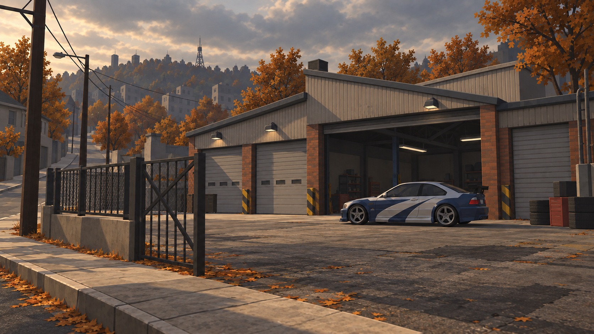 |  |  |

## Asset sheets

### road segments

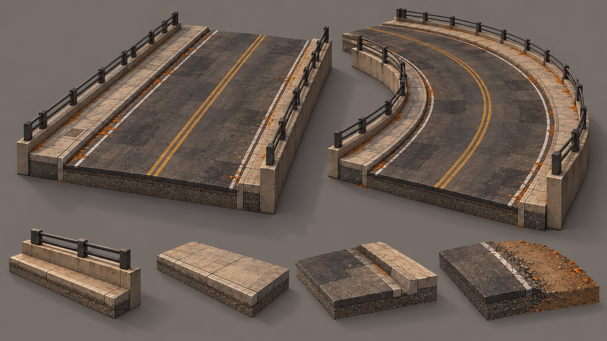

### road junctions

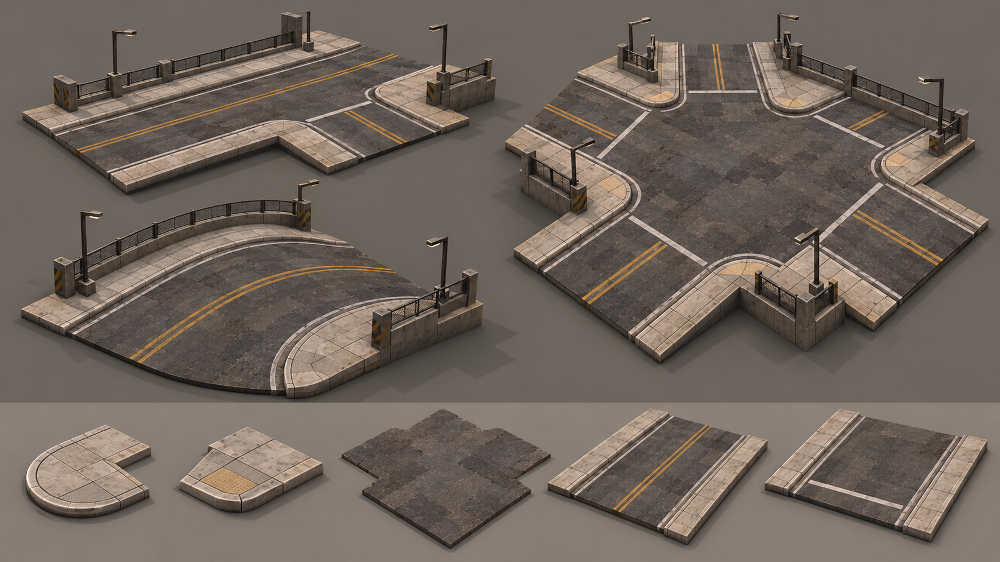

### bridge tunnel retaining

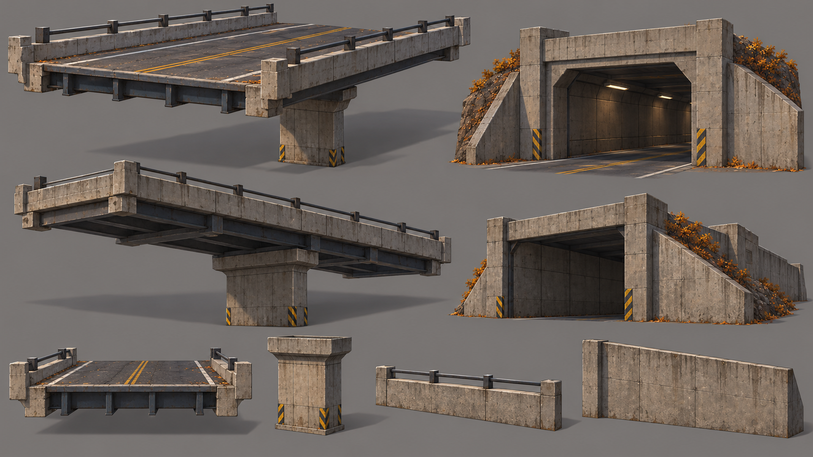

### industrial warehouse

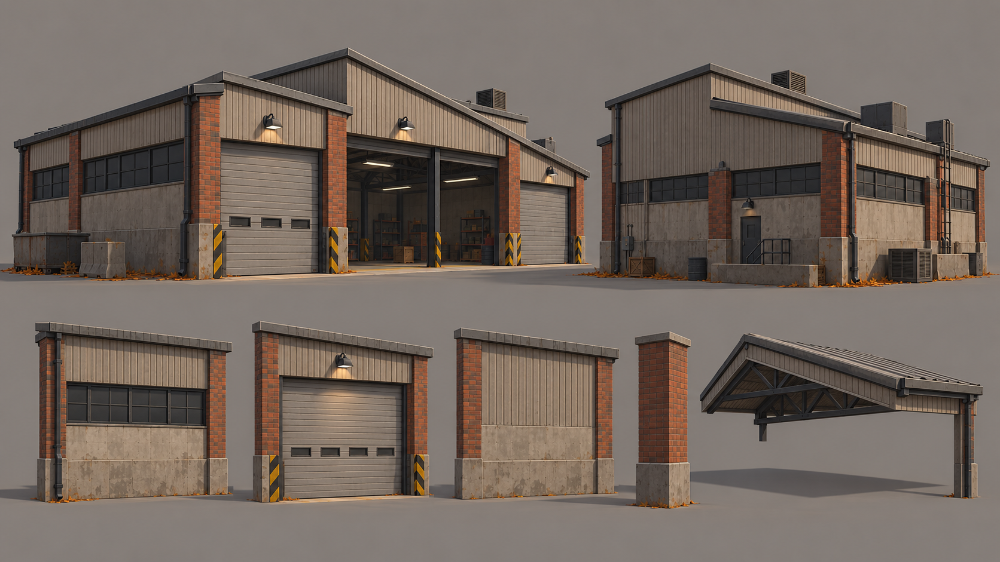

### workshop garage

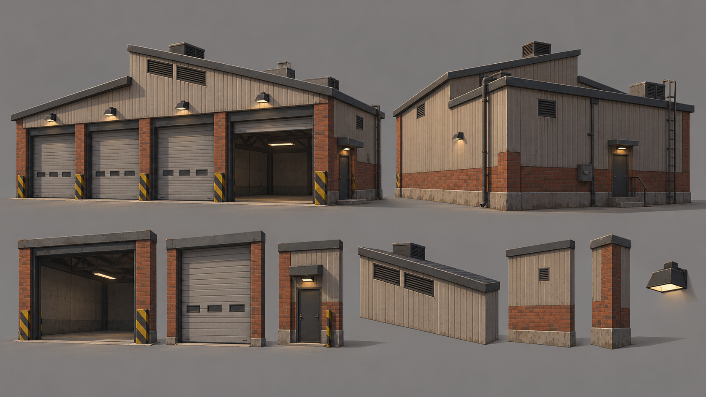

### row buildings shops

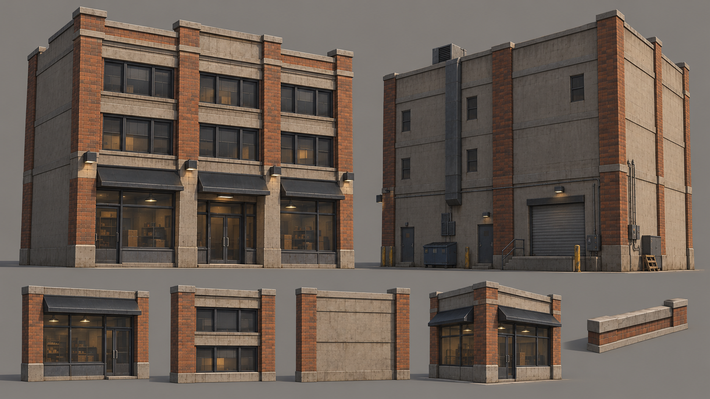

### midrise office parking

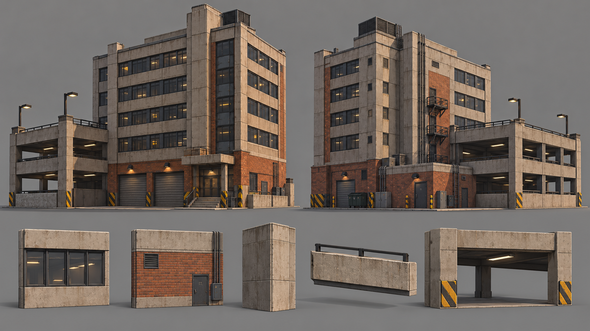

### barriers fences gates

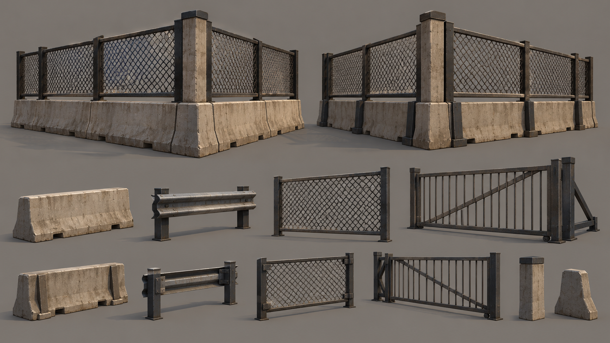

### lights signs signals

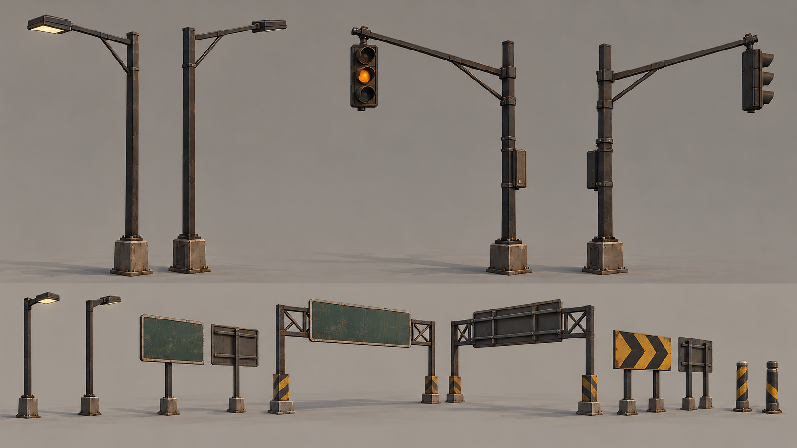

### street furniture

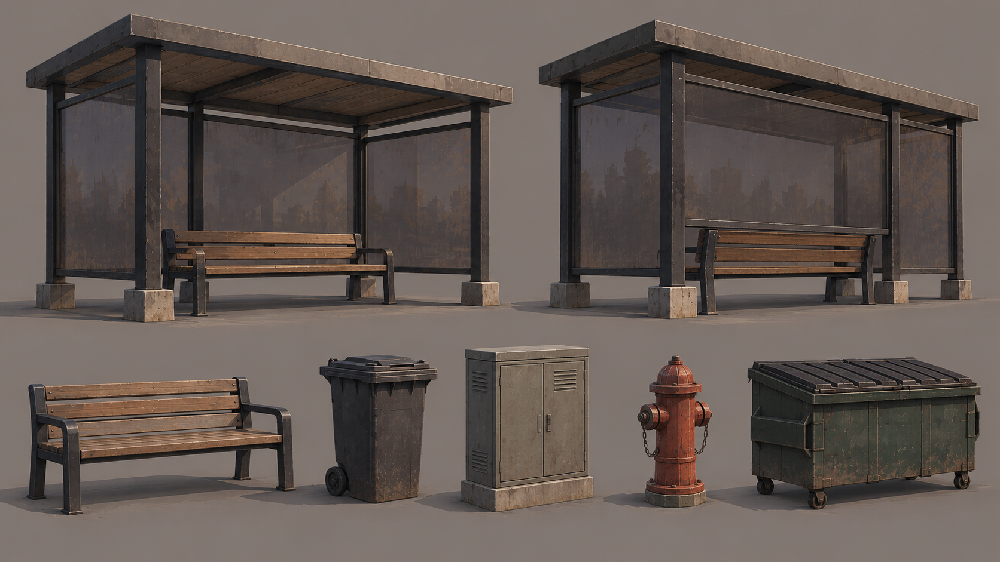

### industrial yard props

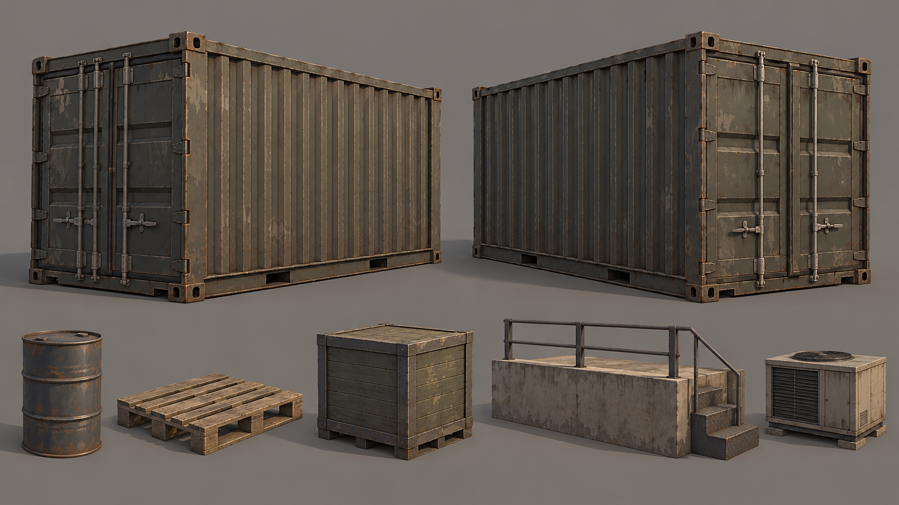

### vegetation rock terrain

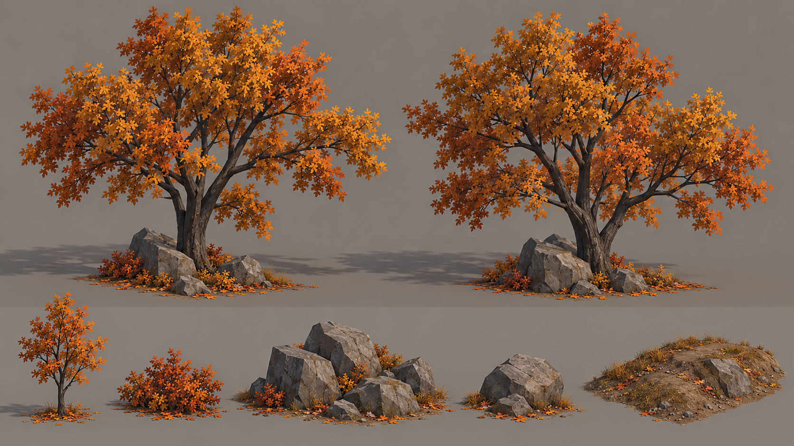

The exact [prompt record](prompts.json) includes the style inputs and generated outputs. This checked-in folder is self-contained and can be copied or zipped for another agent, including all sheets, guides, manifest, prompt record and style anchors.

## Give this to the modeling agent

> Read BLENDER-HANDOFF.md and asset-manifest.json. Use these references to author original modular models and textures in Blender for a new racing map. Preserve the 4 m facade-bay system, the 8 m two-lane road interface, realistic proportions and the medium-detail style. Build a small test street first and show actual rendered results before expanding the kit. Use no Assetto Corsa/NFS World source assets.
