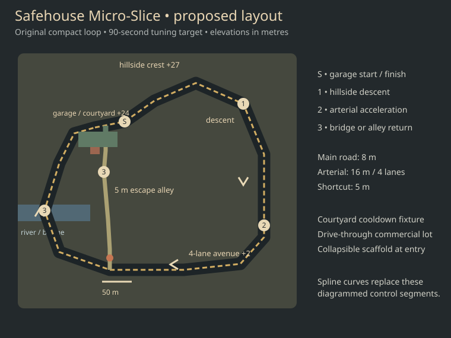
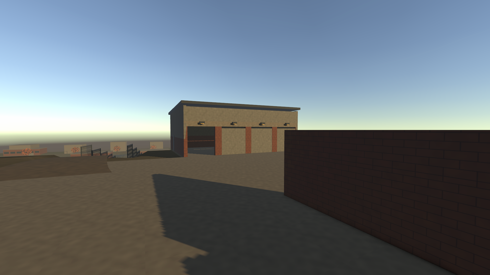
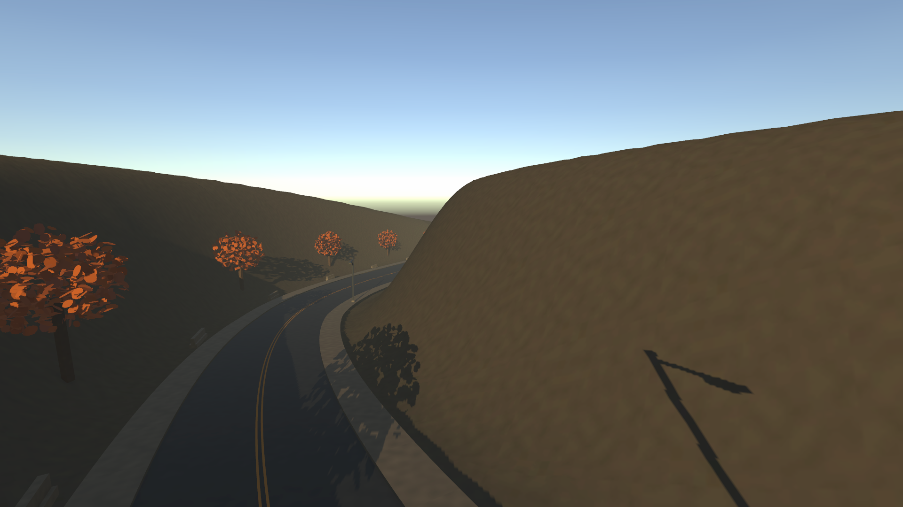
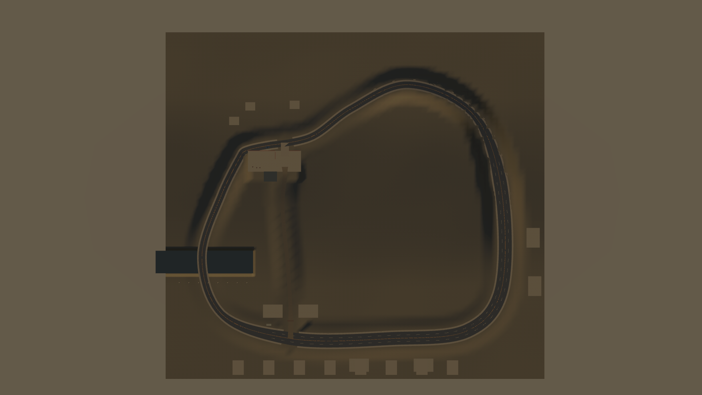

# Safehouse Micro-Slice

A small, independently generated handling circuit around an original workshop, built from the [original map kit references](../art-direction/2026-10-04-original-map-kit/README.md). The main loop is 1,143.6 m in a roughly 400 m footprint, with about 25 m of elevation change. Ninety seconds is the design target, rather than a guaranteed lap time for every vehicle or driver.



## Play it

Use the repository's pinned Unity 6000.3.25f1. Splines 2.8.4 and ProBuilder 6.0.3 are pinned in the package manifest and resolve when Unity opens the project. No private asset pack or Assetto Corsa map is required for this scene.

From the repository root, with this project closed in Unity:

```powershell
$env:UNITY_EDITOR_PATH = 'C:/path/to/6000.3.25f1/Editor/Unity.exe'
./tools/micro-slice.ps1 -Action Setup
./tools/micro-slice.ps1 -Action Tests
./tools/micro-slice.ps1 -Action Build
```

Open `unity/` and load `Assets/Alabama/Art/MicroSlice/SafehouseMicroSlice.unity`, or run `builds/micro-slice/Alabama.exe`. WASD/arrows drive, Space applies the handbrake, R resets the car/lap/props, and Esc pauses; the existing gamepad controls also work.

The public branch contains the construction recipes, layout, package locks, scripts with Unity metadata, and review captures. Setup creates the scene, reusable prefabs, textures, materials and terrain under the existing ignored runtime-art directory. A clean checkout can regenerate this demo without restoring the older scenes' artwork. Setup rebuilds this specific demo and its default kit: save custom scene or model variants separately.

The included original calibration coupe uses the existing four-WheelCollider controller and chase camera. It lets the scene work without the separate car pack. Vehicle-specific handling and final art acceptance should be repeated with the chosen production car.

## Route and fixtures

| Section | Purpose |
| --- | --- |
| Garage and screened courtyard | Start/finish beside a four-bay workshop; one bay has a real open aperture. Courtyard cooldown requires three continuous seconds below 3 m/s with the street observer's view blocked. |
| Hillside drop | Smooth spline crests, up to 18.1% grade, and shallow banking for suspension and camera review. |
| Four-lane arterial | 16 m carriageway: four 3.5 m lanes plus margins. This follows the kit's scale rather than the suggested 6.5 m lanes. |
| River bridge and main return | Guardrails, pier supports and a carved channel under the west-side road. |
| Drive-through lot and escape alley | A real gap between commercial shells leads to a 5 m dirt return beside the workshop. |
| Scaffold breaker | A trigger releases kinematic supports/platforms. Released parts ignore the activating car while remaining physical obstacles to other rigidbodies. |
| Fences and lamps | Light props release before hard contact; their collision layer is separate from roads, curbs and permanent structures. |

Five gates implement four ordered stages: start, hillside, arterial, then either bridge or alley return. Returning to the garage early, duplicate gates, or reverse crossings do not award a lap. The cooldown observer and breaker are functional test fixtures. Traffic, police decision-making and a full pursuit state machine are future work.

## Original asset construction

`MicroSliceKit.cs` builds 13 reusable prefabs: workshop, garage bay, wall bay, warehouse, row shops, Jersey barrier, guardrail, fence, street light, container, crate, broad autumn tree and boulder. Their dimensions and visual treatment follow the reference kit. Geometry, leaf cards, textures and UVs are generated from original recipes.

The circuit lofts an asphalt cross-section along a closed Unity spline, with separate sidewalk/curb colliders, lane markings and per-knot width/bank. The shortcut and garage entry use separate splines. Eight surrounding masses remain editable ProBuilder volumes. The workshop and selected props are a first authored pass; the surrounding district remains a greybox.

The light is 18 degrees above the horizon. An HDR URP global volume applies Neutral tonemapping, temperature +14, contrast +8 and saturation -7; the chase camera explicitly enables post-processing and sees the volume layer.

## Tune the map

- Edit the initial design in [layout.json](layout.json), then run Setup to recreate the scene.
- For an in-editor road adjustment, stop Play Mode, edit a spline's knots and its `SplineRoadProfile` width/bank arrays. Select that road and run **Alabama → Micro Slice → Rebuild Selected Road**. This updates the loft, carved terrain and both probe route samples.
- Adding/removing knots requires matching width and bank entries. Keep the main spline closed, a minimum 5 m shortcut width, and sufficient crest radius for the vehicle.
- Move checkpoint triggers, roadside dressing and building footprints when route edits affect them. The rebuild command preserves those authored objects.
- Edit the separate tuning asset in the generated MicroSlice directory. It does not alter the original car's tuning asset.

## Review and verification

Run `Capture` for actual URP images and both probes after Build for physics-driven automatic laps:

```powershell
./tools/micro-slice.ps1 -Action Capture
./tools/micro-slice.ps1 -Action Probe
./tools/micro-slice.ps1 -Action ProbeShortcut
```

Capture writes to `artifacts/MicroSliceCapture/`. The two probes write `artifacts/MicroSliceProbe/driving.json` and `artifacts/MicroSliceProbeShortcut/driving.json`, use the existing conservative route follower, and exit after one valid lap or 180 simulated seconds. They check route deviation and sustained airborne time; these are driving smoke tests, not player skill benchmarks or frame-rate qualifications. Automatic steering is enabled only with the explicit probe arguments; ordinary play stays under player control.

The 12 focused tests cover ordered/reverse/reset lap behavior, continuous cooldown eligibility, breaker collision immunity/rearming, spline closure, real collider support through crests, alley/open-bay clearance, courtyard approach height, forward shortcut rejoining, prop-trigger coverage and separate collision layers. All passed, and the Windows development build completed with StrictMode and zero errors. Broader project tests for older scenes still require their private asset packs.

| Measured physics lap | Route length | Timed lap | Maximum centreline offset | Longest airborne interval |
| --- | --- | --- | --- | --- |
| Main / bridge return | 1,143.6 m | 51.8 s | 2.14 m | 0.217 s |
| Alley / garage return | 1,025.5 m | 48.0 s | 3.34 m | 0.200 s |

These measured laps are faster than the 90-second design target. Use them as the starting handling baseline when tuning the chosen vehicle and route, rather than treating the target as a measured result.







Measured validation results are recorded in [validation.json](validation.json).
